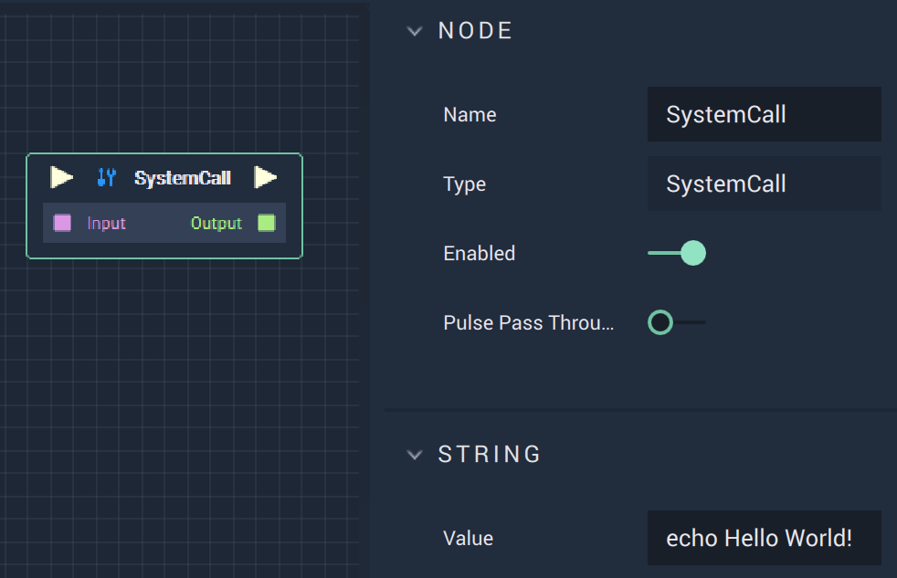

# Overview

The **System Call Node** allows the user to use any commands provided by the operating system (i.e. *Windows*, *Linux*, etc.).

# Attributes

|Attribute|Type|Description|
|---|---|---|
|`Value`|**String**|The desired command.|

# Inputs

|Input|Type|Description|
|---|---|---|
|*Pulse Input* (►)|**Pulse**|A standard **Input Pulse**, to trigger the execution of the **Node**.|
|`Input`|**String**|The desired command.|

# Outputs

|Output|Type|Description|
|---|---|---|
|*Pulse Output* (►)|**Pulse**|A standard **Output Pulse**, to move onto the next **Node** along the **Logic Branch**, once this **Node** has finished its execution.|
|`Output`|**Int**|The resulting output of a command.|

# External Links

* An explanation of [*OS commands*](https://www.tutorialspoint.com/what-are-system-calls-in-operating-system) and some examples.

