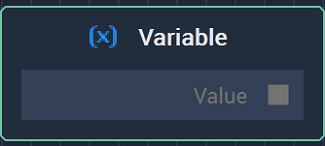

# Overview

The **Variable Getter** **Node** allows the user to obtain the value of a **Variable**.

[**Scope**](../overview.md#scopes):
*  **Project**, **Scene**, **Function**

# Outputs

|Output|Type|Description|
|---|---|---|
| `Value` | _**Data Type** of the **Variable**_ | Value of the **Variable**. |

# See Also

* [**Variable Setter**](variable-setter.md)

