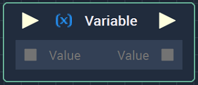

# Overview

The **Variable Setter** **Node** allows the user to set the value of a **Variable**.

*Scope*: **Project**, **Scene**, **Function**

# Inputs

|Input|Type|Description|
|---|---|---|
|*Pulse Input* (►)|**Pulse**|A standard **Input Pulse**, to trigger the execution of the **Node**.|
| `Value` |  _**Data Type** of the **Variable**_ | Value you wish to set the **Variable** to.|

# Outputs

|Output|Type|Description|
|---|---|---|
|*Pulse Output* (►)|**Pulse**|A standard **Output Pulse**, to move onto the next **Node** along the **Logic Branch**, once this **Node** has finished its execution.|
| `Value` |  _**Data Type** of the **Variable**_ | The new value of the **Variable**. |

# See Also

* [**Variable Getter**](variable-getter.md)
