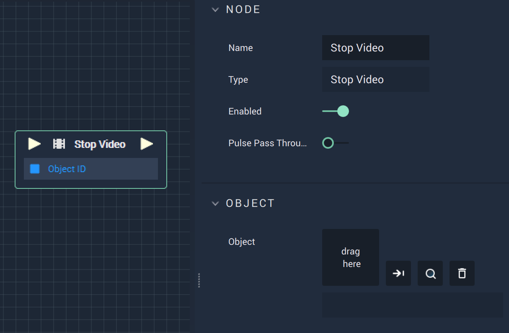

# Stop Video

## Overview

The **Stop Video** **Node** can be used to stop a video file that is playing during the session. This can be specified through the file library to the right, or as an **Object** already in use from a **Scene**.

## Attributes

| Attribute | Type | Description |
| :--- | :--- | :--- |
| `ObjectID` | **Object** | The video **Scene Object** the user wishes to reference. |

## Inputs

| Input | Type | Description |
| :--- | :--- | :--- |
| _Pulse Input_ \(►\) | **Pulse** | A standard **Input Pulse**, to trigger the execution of the **Node**. |

## Outputs

| Output | Type | Description |
| :--- | :--- | :--- |
| _Pulse Output_ \(►\) | **Pulse** | A standard **Output Pulse**, to move onto the next **Node** along the **Logic Branch**, once this **Node** has finished its execution. |

