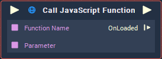

# Overview

The **Call Javascript Function** executes a function that is defined in Javascript.

# Attributes

## Object

|Attribute|Type|Description|
|---|---|---|
| `Object` | **ObjectID** | **Web Sprite** **Object** that contains the definition of the function to be executed. |

## Function

|Attribute|Type|Description|
|---|---|---|
|`JS Function Name` | **String** | Name of the function to be executed, if none is given in the `Function name` **Input Socket**. |

## Inputs

|Attribute|Type|Description|
|---|---|---|
| `Parameters [n]` | **Drop-down** | Label, **Data Type**, and default value of the parameters given to the function. |

# Inputs

|Input|Type|Description|
|---|---|---|
|*Pulse Input* (►)|**Pulse**|A standard **Input Pulse**, to trigger the execution of the **Node**.|
| `Function name` | **String** | Name of the function to be executed. |
| `Parameter [n]` | _Defined in the **Data Type** of the `Parameters` **Attribute**_  | Value of the corresponding parameter. |

# Outputs

|Output|Type|Description|
|---|---|---|
|*Pulse Output* (►)|**Pulse**|A standard **Output Pulse**, to move onto the next **Node** along the **Logic Branch**, once this **Node** has finished its execution.|
| `OnLoaded` | **Pulse** | |

# See Also
 
 * [**On Javascript Callback**](../events/web/on-javascript-callback.md)

