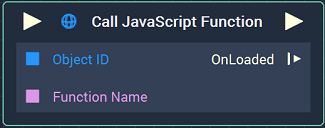
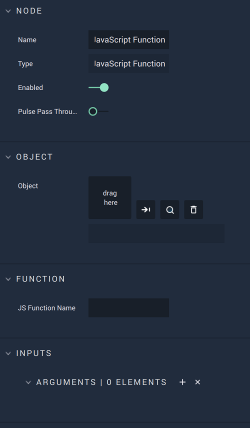

# Call JavaScript Function

## Overview

The **Call JavaScript Function** **Node** executes a JavaScript function that is defined in a **Web Sprite** **Object**, which has to be given to the **Node** as its **Object** **Attribute**.

## Attributes

### Object

| Attribute | Type | Description |
| :--- | :--- | :--- |
| `Object` | **ObjectID** | **Web Sprite** **Object** that contains the definition of the function to be executed, if none is given in the **Input Socket**. |

### Function

| Attribute | Type | Description |
| :--- | :--- | :--- |
| `JS Function Name` | **String** | Name of the function to be executed, if none is given in the `Function name` **Input Socket**. |

### Inputs

| Attribute | Type | Description |
| :--- | :--- | :--- |
| `Parameters [n]` | **Drop-down** | Label, **Data Type**, and default value of the parameters given to the function. |

## Inputs

| Input | Type | Description |
| :--- | :--- | :--- |
| _Pulse Input_ \(►\) | **Pulse** | A standard **Input Pulse**, to trigger the execution of the **Node**. |
| `Object ID` | **ObjectID** | **Web Sprite** **Object** that contains the definition of the function to be executed. |
| `Function name` | **String** | Name of the function to be executed. |
| `Parameter [n]` | _Defined in the **Data Type** of the `Parameters` **Attribute**_ | Value of the corresponding parameter. |

## Outputs

| Output | Type | Description |
| :--- | :--- | :--- |
| _Pulse Output_ \(►\) | **Pulse** | A standard **Output Pulse**, to move onto the next **Node** along the **Logic Branch**, once this **Node** has finished its execution. |
| `OnLoaded` | **Pulse** | Flows to additional actions when the **Web Sprite** **Object** has finished loading. |

## See Also

* [**On Javascript Callback**](../events/web/on-javascript-callback.md)

